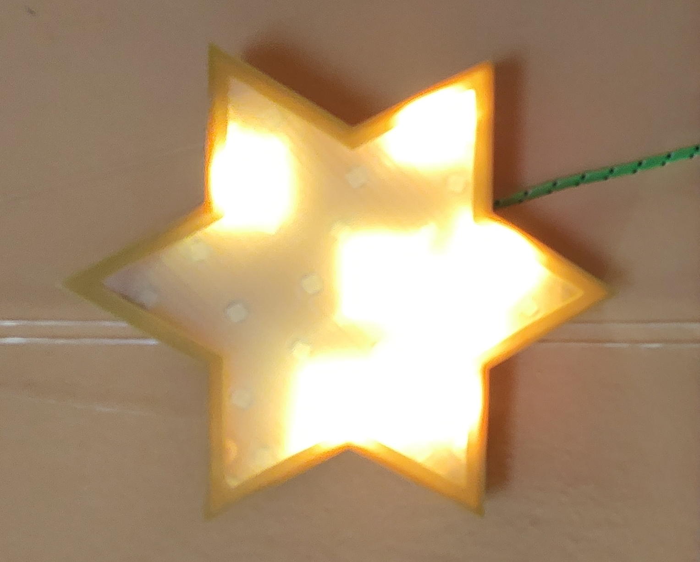
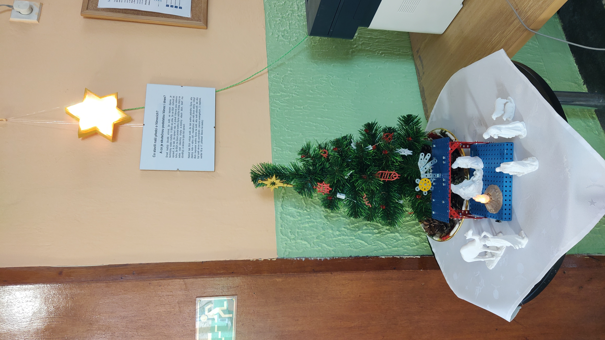

# Git
<h1>Davidova hvězda</h1>
<h2>s LED WS2812B</h2>

Jedná se o ukázku praktického využití mikrokontroleru v podobě vánoční ozdoby a zároveň o přípravek na procvičování programování a algoritmizace.

<h3>Schéma zapojení</h3>

<h3>Soupis použitých komponent</h3>
<ul>
  <li>Řídící jednotka - <a href="https://rpishop.cz/waveshare/4445-waveshare-rp2040-zero-pico-like-mcu-deska-zalozena-na-raspberry-pi-mcu-rp2040-mini-verze-bez-osazenych-headeru.html">Waveshare RP2040-Zero, bez headerů</a></li>
  <li>RGB LED - <a href="https://www.laskakit.cz/100x-inteligentni-rgb-led-neopixel--ws2812b--10x10--5050--5v/">100x inteligentní RGB LED NeoPixel, WS2812B, 10x10, 5050, 5V</a></li>
  <li>Propojovací vodiče - z UTP kabelu</li>
  <li>Programovací a napájecí kabel - programovací kabel USB-A na USB-C</li>
  <li>Zdroj napájení - nabíječna na telefon 5V 2A</li>
</ul>

<h3>3D modely tištěných dílů</h3>

3D modely pro tisk <a href="https://www.printables.com/cs/model/339583-christmas-star">Christmas star</a>

<h3>Fotodokumentace</h3>

<h3>Problémy a řešení</h3>

Připevnění LED do vytištěné desky s otvory - pomocí kobercové pásky. Po několika týdnech se některé LED odlepují. Možná bude fungovat na dvou místech zakápnout každou LED tavnou pistolí.

<h3>Literatura</h3>
<ul>
  <li><a href="https://www.waveshare.com/wiki/RP2040-Zero ">RP2040</a></li>
  <li><a href="https://youtu.be/WpaXMcmwyeU">Raspberry Pi Pico Tutorial : NeoPixels / WS2812B LED's</a></li>
  <li><a href="https://github.com/blaz-r/pi_pico_neopixel/blob/main/neopixel.py">Knihovna neopixel.py</a></li>
  <li><a href="https://github.com/Guitarman9119/Raspberry-Pi-Pico-/blob/main/Neopixel/Example1.py">Příklad použití knihovny neopixel.py</a></li>
</ul>